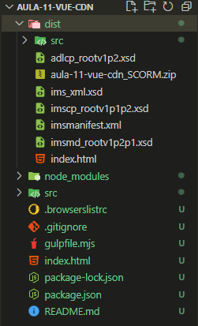

# Projeto de aula SCORM
Use os arquivos para desenvolvimento e no final gere a build para fazer upload no LMS.

## ✨ Exemplo


## 💻 Pré-requisitos

Antes de começar, verifique se você atendeu aos seguintes requisitos:

- Node instalado
- Npm instalado

## 🚀 Instalando na sua máquina

Para instalar, siga estas etapas na raíz do projeto:

```
npm install
```
Havendo o arquivo *package.json*, as dependências serão instaladas corretamente deixando o projeto pronto para fazer a build.

## ☕ Gerando Build e pacote scorm
Gera a pasta *dist* e dentro, estará o pacote SCORM zipado para upload no LMS.
Na raíz do projeto:

```
gulp
```


## 🤝 Autor

Qualquer dúvida, entre em contato:

<table>
  <tr>
    <td align="center">
      <a href="https://github.com/oKelvinCosta" title="Kelvin Costa Github">
        <br>
        <sub>
          <b>Kelvin Costa</b>
        </sub>
      </a>
    </td>
  </tr>
</table>

